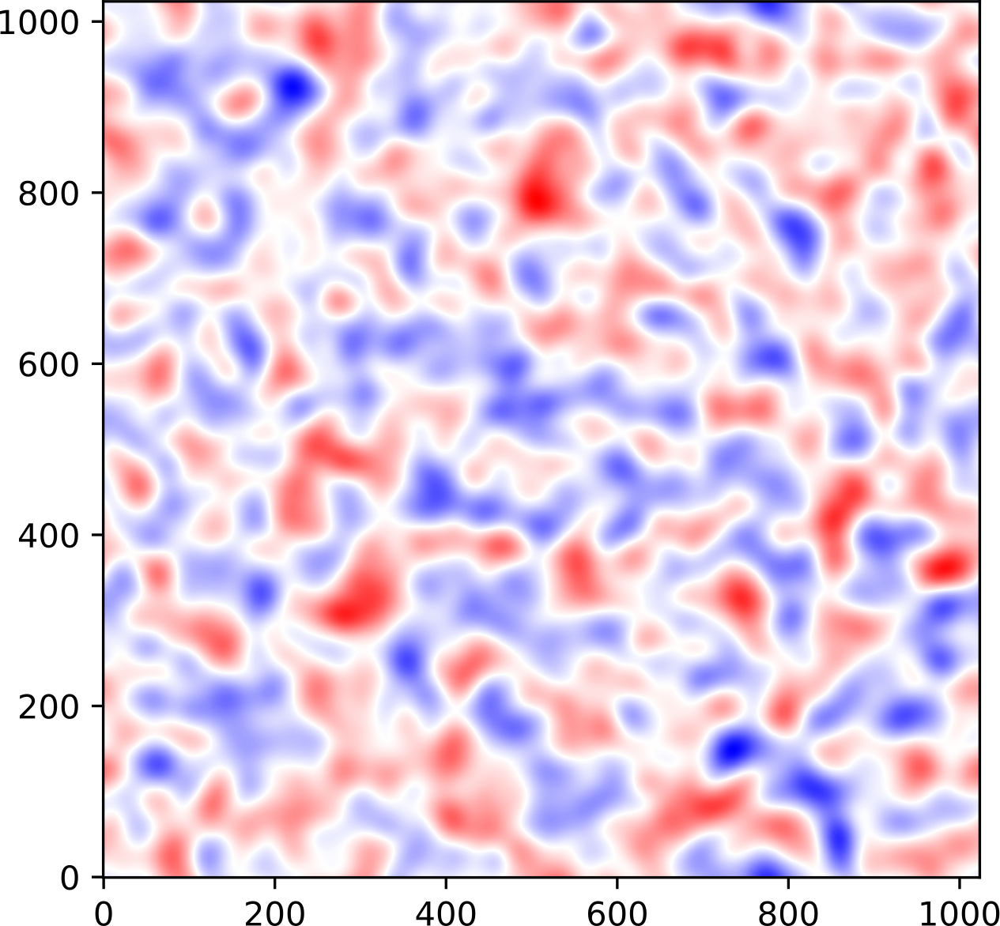
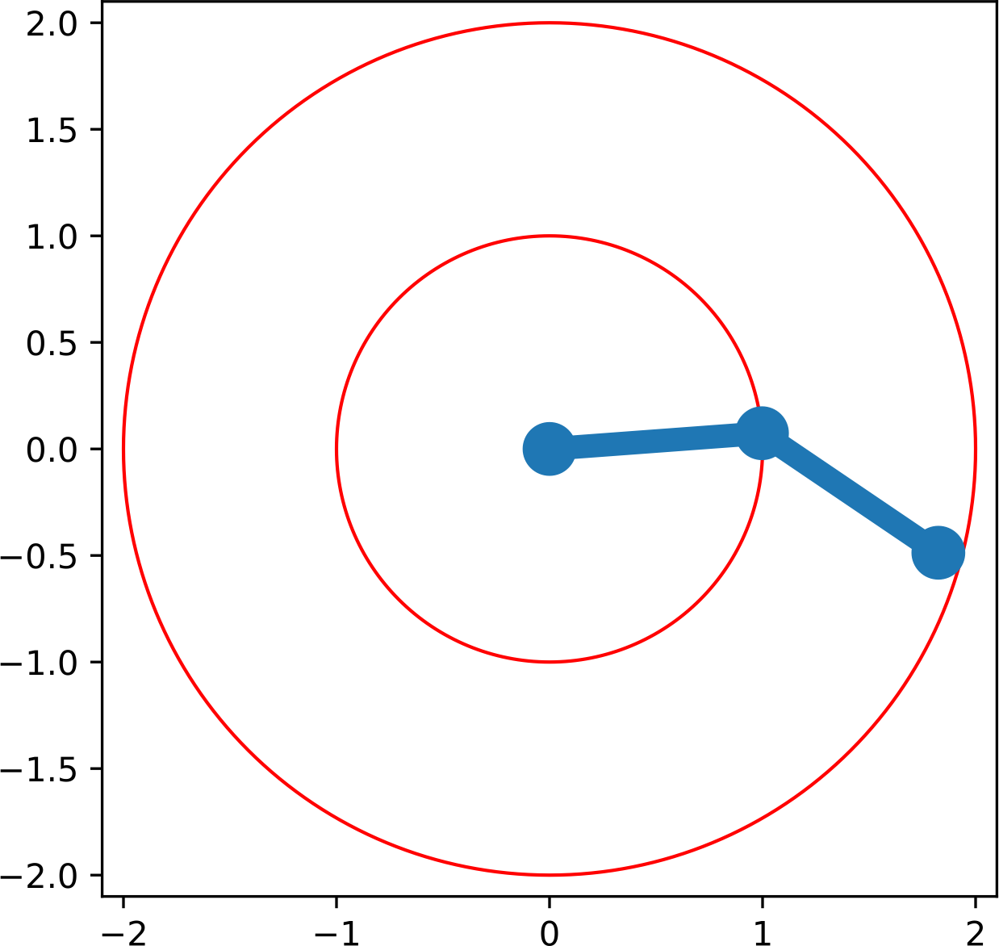
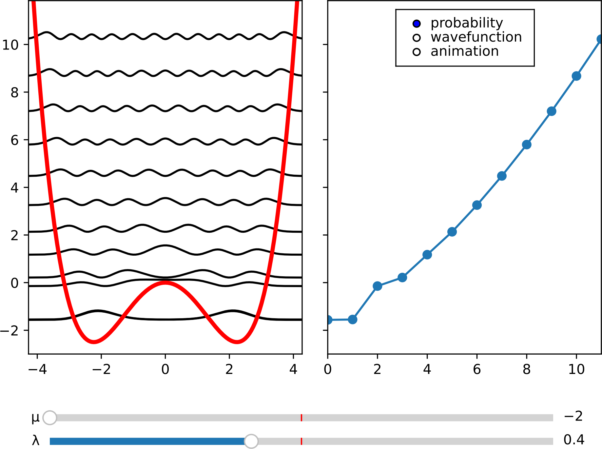
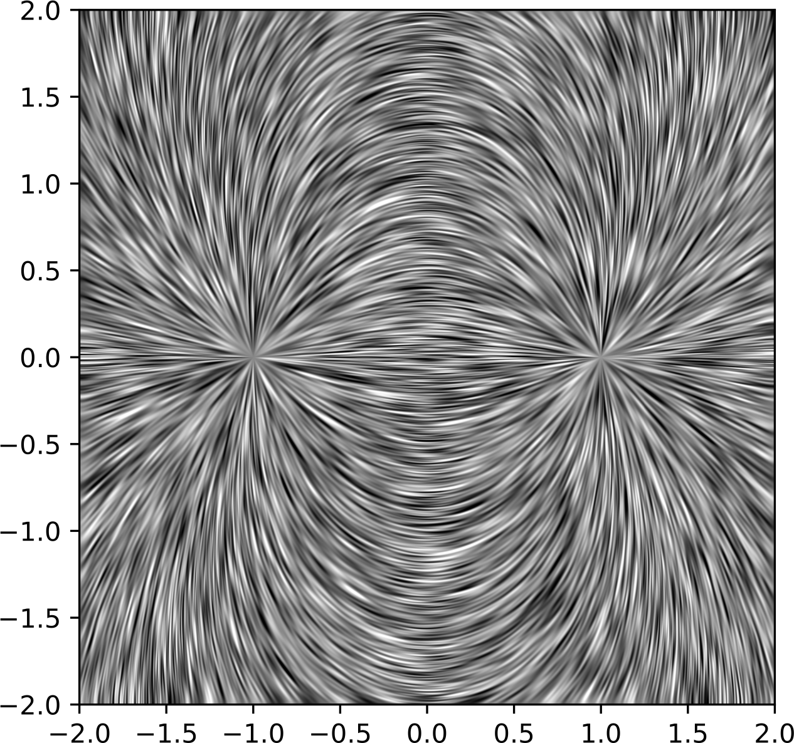
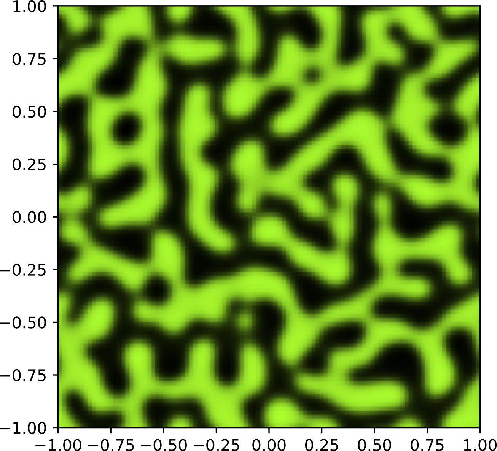

# PHYS395 Gallery

## Applied Math

### Newton's Fractal

### Floquet Exponents

## Statistics

### Random Walk

### Markov Chain Monte-Carlo 

### Gaussian Random Field

## Mechanics

### Ballistic Trajectory 

### Non-linear Resonance  

### Double Pendulum 

## Vibrations & Waves

### Wave Reflections 

## Quantum Mechanics

### Eigenstates of Quantum Oscillator  

### Coherent States 

## Electrodynamics

### Dipole Field Visualization 

### Electrostatic Potential
...

### Cylinder Waveguide Modes

## Condensed Matter

### Ising Model  

### Phase Separation 

## Image Processing

### Non-Local Means

