# PHYS395 Gallery

## Applied Math

### Newton's Fractal: <a href="../04 Root Finding/fractal.py">04 Root Finding/fractal.py</a>
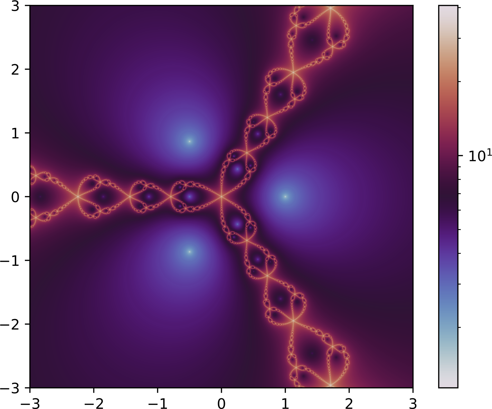

### Floquet Exponents: <a href="../07 ODEs/floquet-2.py">07 ODEs/floquet-2.py</a>
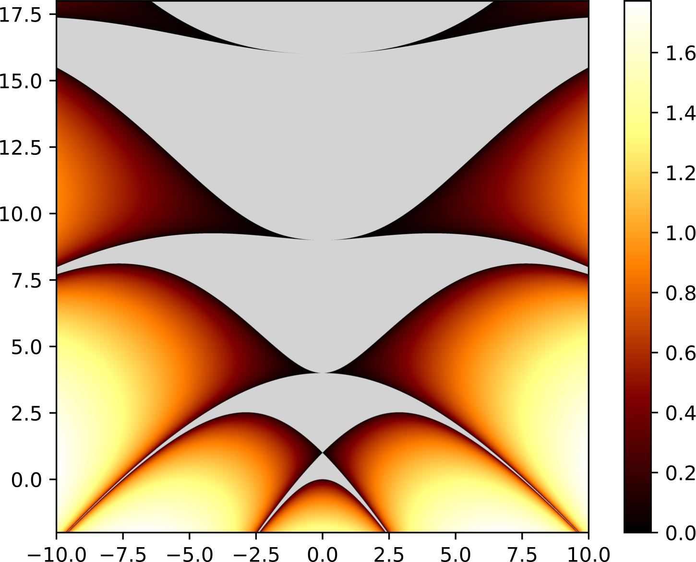

## Statistics

### Random Walk: <a href="../03 Statistics Primer/walk.py">03 Statistics Primer/walk.py</a>
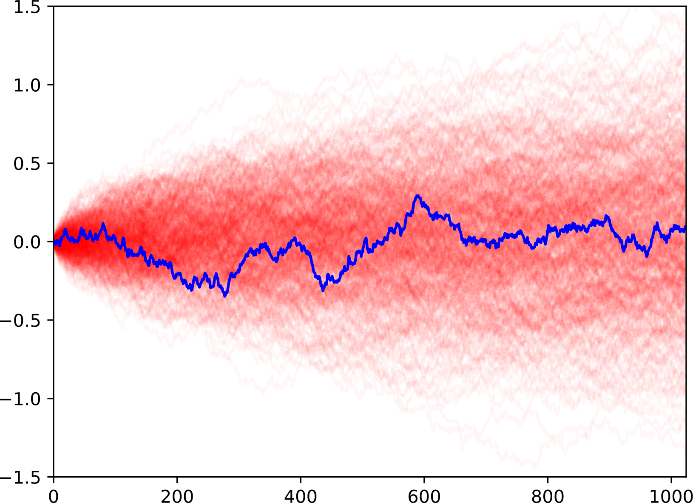

### Markov Chain Monte-Carlo: <a href="../03 Statistics Primer/mcmc-2.py">03 Statistics Primer/mcmc-2.py</a> 
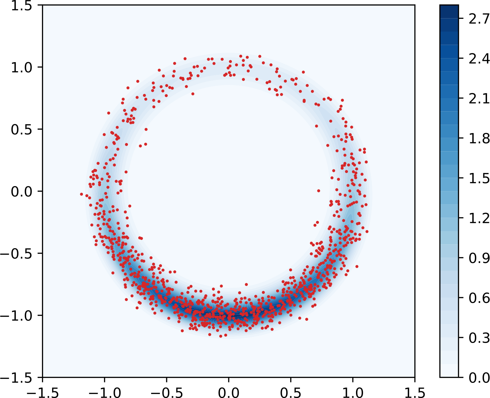

### Gaussian Random Field: <a href="../03 Statistics Primer/field-2.py">03 Statistics Primer/field-2.py</a>

## Mechanics

### Ballistic Trajectory: <a href="../07 ODEs/ballistic.py">07 ODEs/ballistic.py</a> 
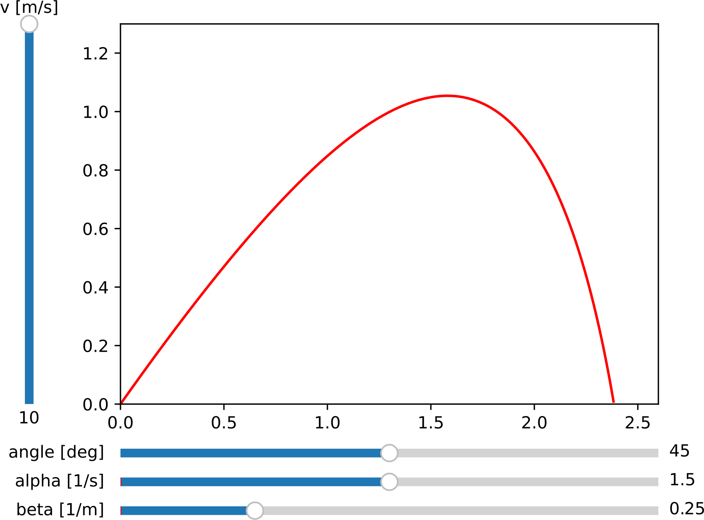

### Non-linear Resonance: <a href="../07 ODEs/resonance.py">07 ODEs/resonance.py</a>  
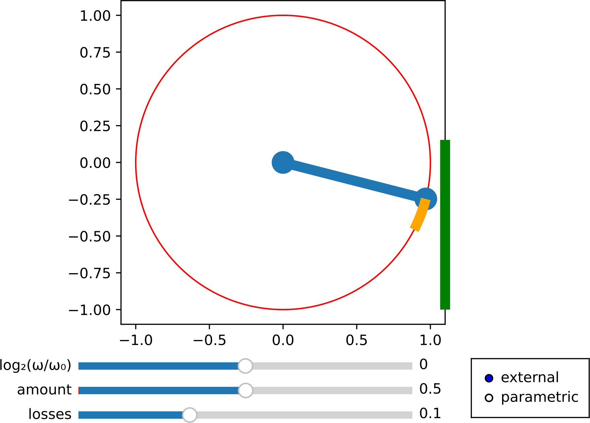

### Double Pendulum: <a href="../07 ODEs/pendulum-2.py">07 ODEs/pendulum-2.py</a> 

## Vibrations & Waves

### Wave Reflections: <a href="../09 Hyperbolic PDEs/wave-1.py">09 Hyperbolic PDEs/wave-1.py</a> 
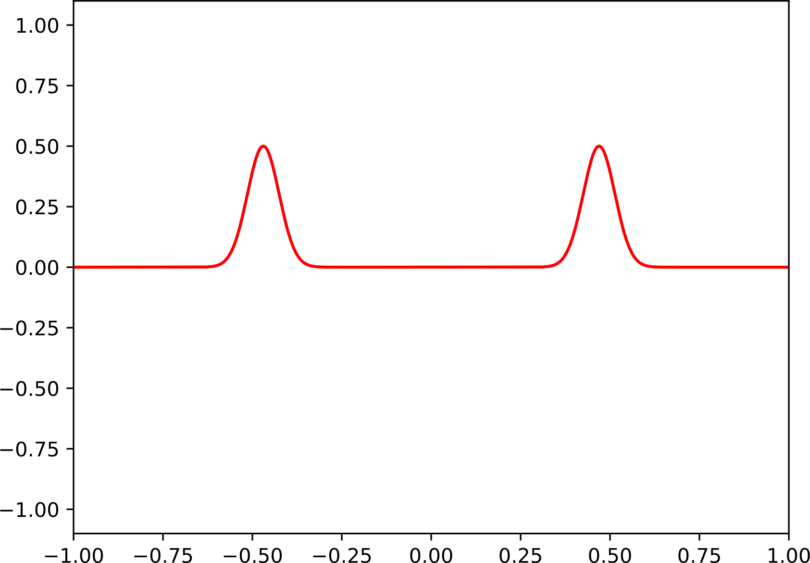

## Quantum Mechanics

### Eigenstates of Quantum Oscillator: <a href="../08 BVPs/quantum.py">08 BVPs/quantum.py</a>  

### Coherent States: <a href="../09 Hyperbolic PDEs/unitary.py">09 Hyperbolic PDEs/unitary.py</a> 
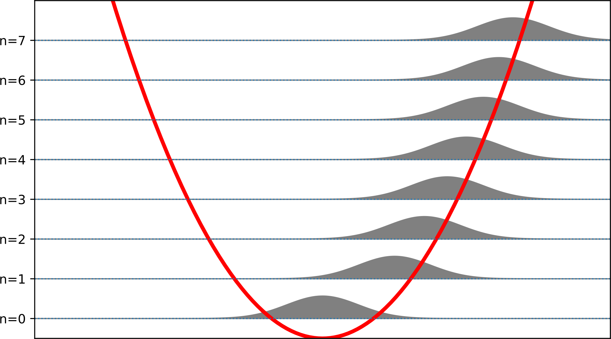

## Electrodynamics

### Dipole Field Visualization: <a href="../10 Parabolic PDEs/stream.py">10 Parabolic PDEs/stream.py</a> 

### Electrostatic Field Strength: <a href="../11 Elliptic PDEs/skyline.py">11 Elliptic PDEs/skyline.py</a>
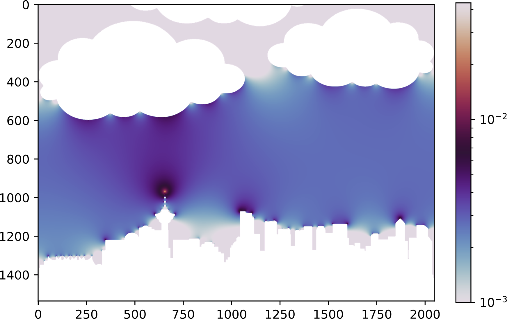

### Cylinder Waveguide Modes
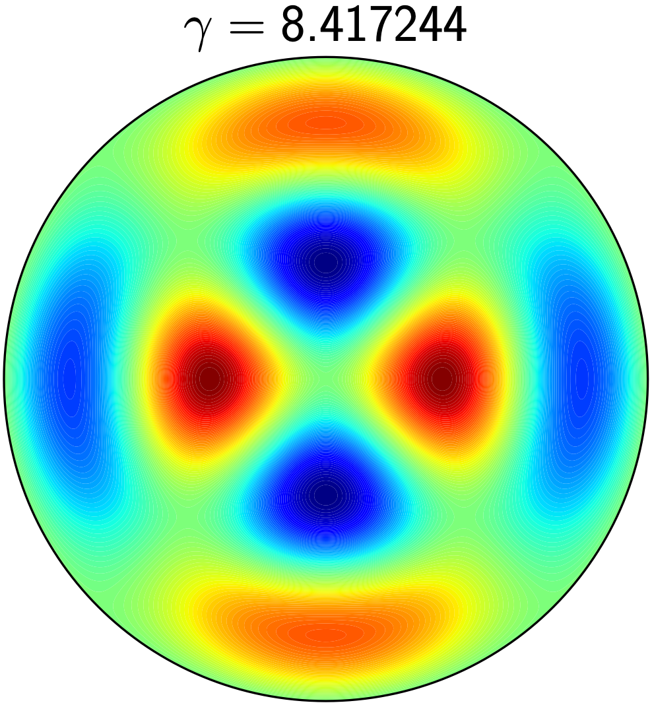

## Condensed Matter

### Ising Model: <a href="../10 Parabolic PDEs/ising.py">10 Parabolic PDEs/ising.py</a>  
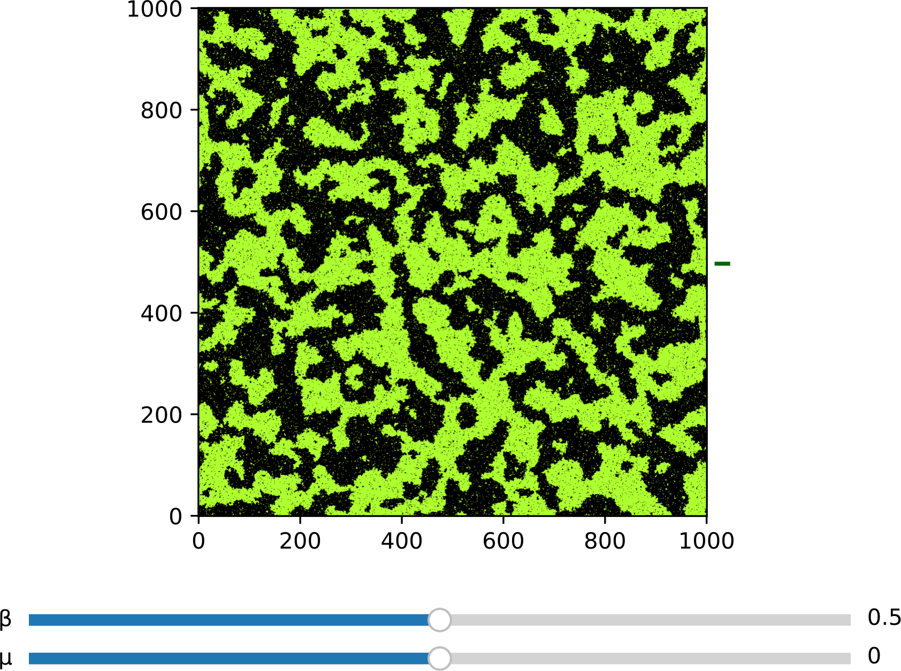

### Phase Separation: <a href="../10 Parabolic PDEs/separate.py">10 Parabolic PDEs/separate.py</a> 

## Image Processing

### Non-Local Means: <a href="../12 Computer Vision/nlmean.py">12 Computer Vision/nlmean.py</a>
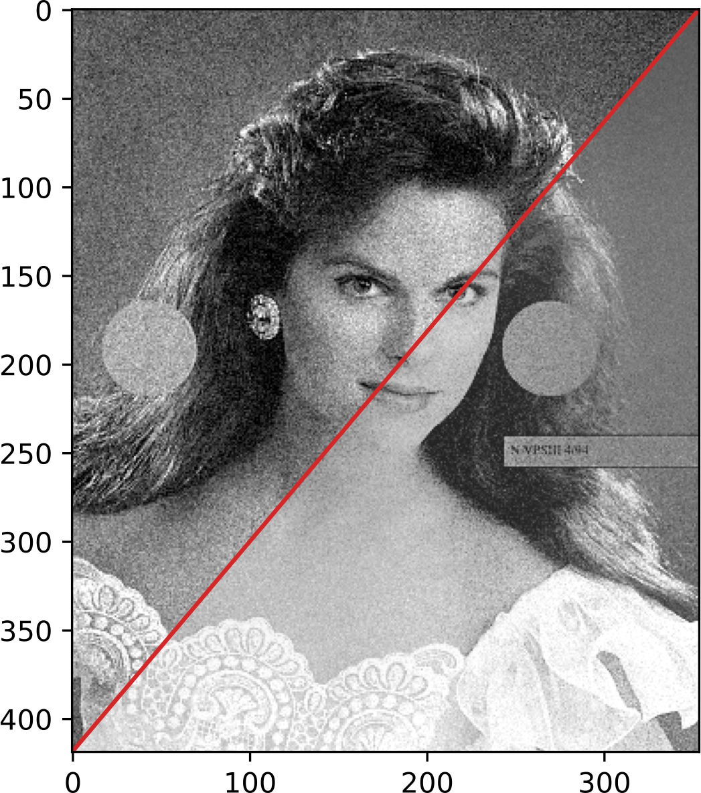
